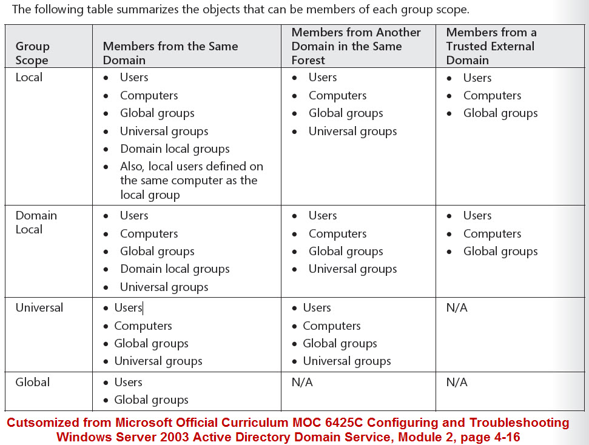
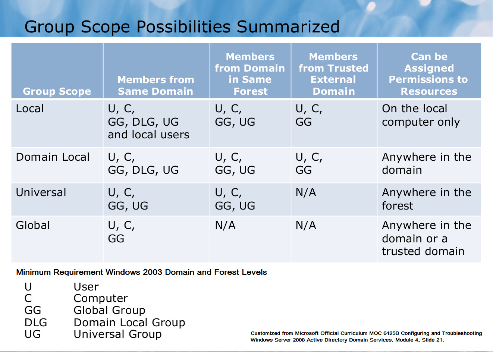
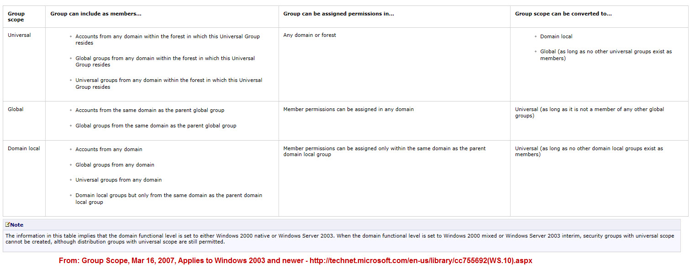
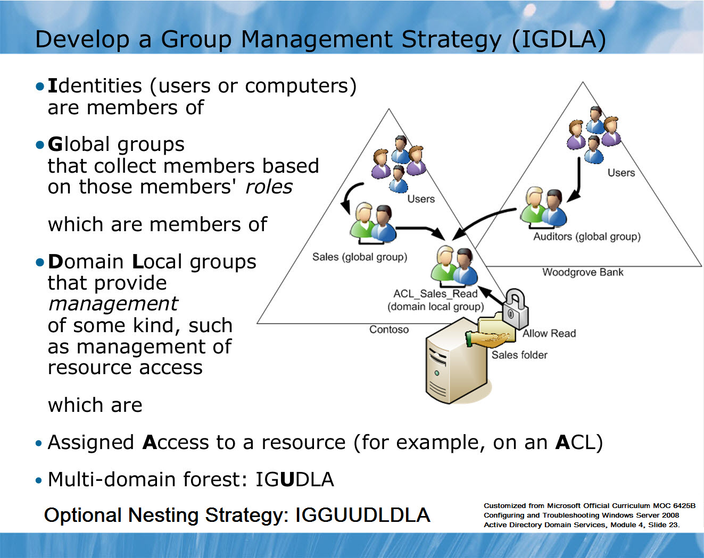

https://blogs.msmvps.com/acefekay/2012/01/06/using-group-nesting-strategy-ad-best-practices-for-group-strategy/

## Verwendung der Gruppenverschachtelungsstrategie - AD Best Practices für die Gruppenstrategie

### Vorwort

Ich habe diesen Blogeintrag übersetzt und erstellt, um einen Einblick geben zu können, wie Active Directory-Gruppen für den Zugriff auf Ressourcen genutzt werden sollten, basierend darauf, wie die Microsoft-Ingenieure sie ursprünglich für die Nutzung konzipiert haben. 
Die hier vorgestellte Methode ist vergleichbar mit der, wie ich sie im Klassenzimmer unterrichten und beschreiben würde. Natürlich bin ich beim Unterrichten vor der Klasse etwas animierter mit einem ′ breiten Whiteboard, wo ich das große Format voll ausnutzen kann. Ich werde es in diesem Blog abschwächen, um Ihre Lesezeit zu verkürzen, einige Grafiken zur Verfügung zu stellen und gleich zur Sache zu kommen.
Einige der Grafiken in diesem Blog sind aktuelle Kursunterlagen, die aus dem Microsoft Official Curriculum MOC 6425C und MOC 6425B Kursunterlagen "Konfiguration und Fehlerbehebung von Windows Server 2008 Active Directory Domain Services" geändert wurden. Weitere Informationen zu diesem 5-Tage-Kurs mit Instructor-Led finden Sie unter folgendem Link:

MOC 6425C Konfiguration und Fehlerbehebung von Windows Server 2008 Active Directory Domain Services -
5 Tage, von einem Instructor geleitet, im Klassenzimmer oder online.
http://www.microsoft.com/learning/en/us/Course.aspx?ID=6425C&Locale=en-us

Es gibt auch 20 Stunden, eine selbstgesteuerte Online-Version dieses Kurses ist ebenfalls verfügbar. Informationen zu dieser Version finden Sie unter dem untenstehenden Link. Zum Zeitpunkt dieses Schreibens, 31.12.2011, betragen die Kosten USD $319,00:
https://www.microsoftelearning.com/eLearning/offerDetail.aspx?offerPriceId=222031

Der vom Instruktor geführte Kurs kostet viel mehr. Für die Preisgestaltung wenden Sie sich bitte an ein Microsoft CPLS-Center (Certified Partner for Learning Solutions).
Die in diesem Blog verwendete Terminologie beinhaltet die Terminologie IGDLA (Resource Access Design Practice), kurz für "Identities, Global Groups, Domain local groups, and Access".

Die bisherige Terminologie war jedoch AGDLP, kurz für "Add Accounts to Global Groups, then to Domain Local Groups, then apply Permissions to the Domain Local Group".
Bei jedem anderen Namen erhält der Benutzer am Ende des Tages die Berechtigungen, die für die lokale Domänengruppe auf der Ressource gelten. IGDLA bietet mehr einen allgemeinen Anwendungsbereich und definiert nicht nur spezifisch, wie AD-Gruppen funktionieren. Die IDGLA passt sich der aktuellen Terminologie der branchenüblichen Praxis an, was der Grund dafür war, sie zu ändern. 

### Was sind Gruppen und wofür werden sie verwendet

Bevor Sie Gruppen in Ihrer Umgebung implementieren, ist es von Vorteil zu verstehen, wie Gruppen verwendet werden und welche Arten von Gruppen es gibt. Es ist auch wichtig, den Gruppenumfang zu verstehen, um die richtige Gruppenart und Verwendung in verschiedenen Szenarien zu identifizieren. Darüber hinaus ist es wichtig, eine Gruppennamenskonvention zu definieren, um einfacher zu "sehen", was der Gruppentyp und die Absichten sind, wenn man sich nur den Namen der Gruppe ansieht, sowie die Funktion zum Verschachteln von Gruppen und die Vorteile dieses Ansatzes zu verstehen.

Die Verwendung von Gruppen macht es für das Betriebssystem effizienter, Berechtigungen für eine ACL aufzuzählen. Stellen Sie sich vor, Sie haben 300 Benutzerkonten auf einer ACL. Das System muss jedes einzelne Benutzerkonto bzw. die SID-Nummern des Benutzerkontos in der ACL auflisten. Dies wird als Leistungsrückstand erkannt. Es ist nicht nur ein Performance-Hit, es ist auch schwer, den Überblick zu behalten.

Wenn Sie Gruppen verwenden, fügen Sie der Ressource den Gruppennamen hinzu. Sie fügen das Benutzerkonto auch der Gruppe in Active Directory hinzu. Was also passiert, ist, wenn sich der Benutzer anmeldet, hat das Sitzungsticket, das zusammengestellt wird, die Benutzerkonten-SID und die Gruppen-SID. Wenn Sie auf die Ressource zugreifen, gleicht das System daher einfach die SID-Einträge des Sitzungstickets des Benutzers mit den SID-Einträgen auf der Ressourcen-ACL ab. Sehr einfach, einfach zu verwalten und äußerst effizient.
Beachten Sie, dass einige der Funktionen in Ihrer Active Directory-Infrastruktur vorhanden sein können oder nicht, je nachdem, welche Betriebssystemversion Ihre Domänencontroller sind, oder in einer gemischten NT4-Umgebung. Was der älteste Domänencontroller ist, der noch in der Domäne und/oder im Forest existiert, ist ebenfalls ein Faktor. Funktionen wie die Gruppenverschachtelung sind möglicherweise nicht vorhanden, wenn die AD-Domäne und/oder die Forstfunktionsebenen nicht auf den neuesten Stand gebracht wurden. Die Verwendung von Gruppen trägt auch dazu bei, den allgemeinen Verwaltungsaufwand für den Umgang mit dem Benutzerzugriff zu reduzieren, anstatt einfach ein Benutzerkonto zu einer Ressource hinzuzufügen. Was passiert, wenn dieser Benutzer das Unternehmen verlässt? 
Einige Institutionen behalten das Konto, deaktivieren es aber. Andere Institutionen werden das Konto löschen. Was passiert also, wenn Sie ein Benutzerkonto löschen, das noch in einer ACL angegeben ist? 
Das Benutzerkonto in der ACL einer Ressource bleibt erhalten, aber nur als SID-Nummer und nicht der Name des Benutzerkontos, da es gelöscht wurde. Dies kann verwirrend werden, um herauszufinden, wer das Konto war, aber an diesem Punkt spielt es keine Rolle, weil du weißt, dass es ein Konto war, das gelöscht wurde. In diesem Fall können Sie nur den SID-Eintrag in der ACL löschen. Es sei denn, Sie sollten das Konto reanimieren, ob Sie eine autorisierte Wiederherstellung durchführen, ADRestore.Net verwenden oder ein Konto aus dem AD-Papierkorb mit Windows 2008 R2 oder neuer wiederherstellen, aber das ist ein anderes Thema außerhalb des Umfangs dieses Blogs.

Und was passiert, wenn Sie nur Benutzerkonten anstelle von Gruppen verwenden? Man könnte sagen, dass ich nur 20 Benutzer habe, also werde ich es einfach per Benutzerkonto tun. Dann, nach einer Weile, wächst das Unternehmen, mehr Benutzer werden eingestellt, Sie fügen sie immer wieder Ressourcen hinzu, die auf ihren Benutzerkonten basieren, aber eines Tages schauen Sie es sich an und sagen: Wow, wir haben jetzt über 200 Benutzer, und wir haben Probleme, den Überblick zu behalten, wer Zugang zu was hat. 
Wenn ich nur anfangs Gruppen benutzt und einfach Benutzer zu den Gruppen hinzugefügt oder entfernt hätte, wenn sich ihre Rollen oder Positionen im Unternehmen geändert hätten, hätte ich einen besseren Umgang mit diesem Durcheinander gehabt, und es wäre eine Sache weniger auf meinem Teller, mit der ich mich jetzt befassen müsste.

### Rollengruppen

Wir können rollenbasierte Gruppen erstellen, um die tägliche Administration zu erleichtern. Rollengruppen, z.B. basierend auf ihren Funktionen:
* Umsatz
* Marketing
* Buchhalter
* Manager
* Leiter der Buchhaltung
* Vertriebsleiter
* etc

### Gruppenbenennungskonvention

Die Namenskonvention ist wichtig. Normalerweise möchte ich meine Gruppen nach Gruppentyp, Rolle und Zugriff benennen. Zum Beispiel werde ich eine Global Group (GG) für die Buchhalter erstellen, die nur Lesezugriff benötigen:
G_Buchhalter_Lesen

Und für die Buchhalter, die volle Kontrolle brauchen:
G_Buchhalter_FC

Natürlich möchten wir normalerweise nicht die volle Kontrolle übernehmen, denn neben der vollen Kontrolle, die es erlaubt, etwas zu ändern, erlaubt es auch die Möglichkeit, Berechtigungen zu ändern und das Eigentum an einer Ressource zu übernehmen. In vielen Fällen funktioniert die NTFS-Berechtigung "Ändern" gut, und die Benutzer werden den Unterschied nicht kennen, solange sie sehen, dass sie Elemente erstellen, ändern und löschen können.

Zusammenfassend lässt sich sagen, dass Sie rollenbasierte Gruppen erstellen und richtig benennen sollten, um sie leicht zu identifizieren und zu verwalten.

Gültigkeitsbereiche für Gruppen
Es gibt vier Gruppenbereiche:
* Lokal
* Global
* Domäne Lokal
* Universell

Die Merkmale, die die Gültigkeitsbereiche definieren, fallen in diese Kategorien:

* Replikation. Wo ist die Gruppe definiert und in welche Systeme wird die Gruppe repliziert?
Mitgliedschaft. Welche Arten von Sicherheitsprinzipien kann die Gruppe als Mitglieder enthalten? Kann die Gruppe Sicherheitsprinzipien aus vertrauenswürdigen Domänen aufnehmen?
* Verfügbarkeit. Wo kann die Gruppe eingesetzt werden? Ist die Gruppe verfügbar, um sie zu einer anderen Gruppe hinzuzufügen? Ist die Gruppe verfügbar, um sie zu einer ACL hinzuzufügen?
* Verfügbarkeits des Vertrauens. Ein Trust erlaubt es einer Domäne, zur Benutzerauthentifizierung auf eine andere Domäne zu verweisen, Sicherheitsprinzipien der anderen Domäne als Gruppenmitglieder aufzunehmen und Berechtigungen den Sicherheitsprinzipien der anderen Domäne zuzuweisen. 
* Verfügbarkeit. Eine lokale Gruppe hat nur einen maschinenweiten Anwendungsbereich. Es kann nur in ACLs auf dem lokalen Rechner verwendet werden. Eine lokale Gruppe kann nicht Mitglied einer anderen Gruppe sein.

Die verwendete Terminologie kann verwirrend sein. Wenn Domain A Domain B vertraut, ist Domain A die vertrauenswürdige Domain und Domain B die vertrauenswürdige Domain. Domäne A akzeptiert die Anmeldeinformationen von Benutzern in Domäne B. Sie leitet Anfragen von Domänen-B-Benutzern zur Authentifizierung an einen Domänencontroller in Domäne B weiter, weil sie dem Identitätsspeicher und Authentifizierungsdienst von Domäne B vertraut. Domäne A kann die Sicherheitsprinzipien von Domäne B zu Gruppen und ACLs in Domäne A hinzufügen.

### Lokale Gruppen:
Lokale Gruppen sind wirklich lokal. Sie werden erstellt, definiert und sind nur für den spezifischen Computer verfügbar, auf dem sie erstellt wurden. Lokale Gruppen werden in der lokalen Security Accounts Manager (SAM)-Datenbank eines Domänenmitgliedscomputers erstellt, unabhängig davon, ob es sich um einen Arbeitsplatz oder einen Server handelt.

* Replikation: Da eine lokale Gruppe nur auf einer bestimmten Maschine existiert, werden die Gruppe und ihre Zugehörigkeit zu keinem anderen System repliziert und stehen nur für jede Art von Verwendung auf dieser bestimmten Maschine zur Verfügung.

* Mitgliedschaft: Eine lokale Gruppe kann als Mitglieder aufgenommen werden:
  - Alle Sicherheitsprinzipale der Domäne, Computer, globalen Gruppen oder lokalen Domänengruppen.
  - Benutzer, Computer und globale Gruppen aus jeder Domäne im Forest.
  - Benutzer, Computer und globale Gruppen aus jeder Domäne in einer Vertrauenstellung.
  - Universelle Gruppen, die in jeder beliebigen Domäne im Forest definiert sind.

### Best Practice zur lokalen Gruppenverwendung:

In einer Arbeitsgruppe können Sie lokale Gruppen verwenden, um die Sicherheit von Ressourcen auf einem System zu verwalten. In einer Domäne wird die Verwaltung der lokalen Gruppen von Einzelmaschinen jedoch zu einem administrativen Aufwand und ist größtenteils unnötig. Es wird nicht empfohlen, benutzerdefinierte lokale Gruppen für Domänenmitglieder zu erstellen. Es gibt nur sehr wenige Szenarien in einer Domänenumgebung, die über lokale Gruppen angesprochen werden. 
In den meisten Fällen sind die lokalen Gruppen Benutzer und Administratoren die einzigen beiden lokalen Gruppen, mit deren Verwaltung Sie sich in einer Domänenumgebung wirklich befassen sollten. Sie können die GPO-Einstellung Eingeschränkte Gruppen verwenden, um diese beiden Gruppen im gesamten Forest einfach zu verwalten.

Verwendung von eingeschränkten Gruppen
http://www.windowsecurity.com/articles/Using-Restricted-Groups.html 
Eingeschränkte Gruppen werden für die lokale Gruppenleitung erstellt:
http://www.frickelsoft.net/blog/?p=13 
 
### Domänenlokale Gruppen (DLGs):

DLGs werden in erster Linie zur Verwaltung von Berechtigungen für Ressourcen verwendet, d.h. sie dienen meist als Regelgruppen. Beispielsweise würde die Gruppe ACL_Sales Folders_Read, die zuvor in der Lektion besprochen wurde, Folgendes bewirken
als lokale Domänengruppe erstellt werden. 

### Lokale Domänengruppen haben die folgenden Eigenschaften:
* Replikation. Eine lokale Domänengruppe ist im Kontext des Domänennamens definiert. Das Gruppenobjekt und seine Zugehörigkeit (das Member-Attribut) werden auf jeden Domänencontroller in der Domäne repliziert.
* Mitgliedschaft. Eine lokale Domänengruppe kann als Mitglieder aufgenommen werden:
Alle Sicherheitsprinzipien der Domänenbenutzer, Computer, globalen Gruppen oder anderen lokalen Domänengruppen.
Benutzer, Computer und globale Gruppen aus jeder Domäne im Wald.
Benutzer, Computer und globale Gruppen aus jeder vertrauenswürdigen Domäne.
Universelle Gruppen, die in jeder beliebigen Domäne im Wald definiert sind.
* Verfügbarkeit. Eine lokale Domänengruppe kann zu ACLs auf jeder Ressource auf jedem Domänenmitglied hinzugefügt werden. Darüber hinaus kann eine lokale Domänengruppe Mitglied anderer lokaler Domänengruppen sein oder sogar lokale Gruppen bearbeiten.

Die Mitgliedschaftsfähigkeiten einer lokalen Domänengruppe (die Gruppen, zu denen eine lokale Domänengruppe Zugang hat).
belong) sind identisch mit denen der lokalen Gruppen, aber die Replikation und Verfügbarkeit der Domäne local
Gruppe machen es für die gesamte Domäne nützlich.

### DLGs Best Practice:

Lokale Domänengruppen eignen sich gut für die Definition von Betriebsführungsregeln, wie beispielsweise Ressourcenzugriffsregeln, da die Gruppe überall in der Domäne angewendet werden kann und Mitglieder aller Art innerhalb der Domäne und Mitglieder aus vertrauenswürdigen Domänen enthalten kann. So kann beispielsweise eine domänenlokale Sicherheitsgruppe namens ACL_Sales Folders_Read verwendet werden, um den Lesezugriff auf eine Sammlung von Ordnern zu verwalten, die Verkaufsinformationen auf einem oder mehreren Servern enthalten.
 
### Globale Gruppen

Globale Gruppen werden in erster Linie verwendet, um Sammlungen von Domänenobjekten (Benutzer, andere globale Gruppen und Computer) basierend auf Geschäftsrollen zu definieren, was bedeutet, dass sie hauptsächlich als Rollengruppen dienen. 
Rollengruppen, wie z.B. die Gruppen Sales und Marketing, und Rollen von Computern, wie z.B. eine Gruppe von Sales Laptops, werden in der Regel als globale Gruppen angelegt.
#### Globale Gruppen haben die folgenden Merkmale:

* Replikation. Eine globale Gruppe ist im Kontext des Domain-Namens (die Domain selbst) definiert. Das Gruppenobjekt, einschließlich des Member-Attributs, wird auf alle Domänencontroller nur in der Domäne repliziert, in der sie erstellt wurden.
* Mitgliedschaft. Eine globale Gruppe kann nur die Benutzer, Computer und andere globale Gruppen in der gleichen Domäne als Mitglieder aufnehmen, in der die globale Gruppe erstellt wurde.
* Verfügbarkeit. Eine globale Gruppe steht allen Domänenmitgliedern und allen anderen Domänen im Wald und allen vertrauenswürdigen externen Domänen zur Verfügung. Eine globale Gruppe kann Mitglied einer beliebigen lokalen oder universellen Domänengruppe in derselben Domäne oder anderen Domänen im Wald sein. Es kann auch Mitglied einer beliebigen lokalen Domänengruppe in einer vertrauenswürdigen Domäne sein. Globale Gruppen können zu ACLs in der Domäne, im Wald oder in vertrauenswürdigen Domänen hinzugefügt werden.

Globale Gruppen haben die begrenzteste Mitgliedschaft (nur Benutzer, Computer und globale Gruppen derselben Domäne), aber die breiteste Verfügbarkeit in der Domäne, im Forest und in vertrauenswürdigen Domänen.

### Best Practice der globalen Gruppe:

Globale Gruppen eignen sich gut zur Definition von Rollen, da Rollen in der Regel Sammlungen von Objekten aus demselben Verzeichnis sind. Beispielsweise können globale Sicherheitsgruppen namens Consultants und Sales verwendet werden, um Benutzer zu definieren, die Berater bzw. Verkäufer sind.

### Universelle Gruppen

Im Gegensatz zu lokalen Gruppen auf globaler und Domänenebene ist die Verwendung von Universal Groups nicht auf den Rollen- oder Regeltyp von Gruppen beschränkt; sie können je nach Szenario in beiden Gruppentypen verwendet werden.

#### Universelle Gruppen haben die folgenden Eigenschaften:
* Replikation. Eine universelle Gruppe ist in einer einzigen Domäne im Wald definiert, wird aber in den globalen Katalog repliziert, der die universelle Gruppe für alle Domänen, forstweit, und für vertrauenswürdige Domänen und Wälder verfügbar macht. 
* Mitgliedschaft. Eine universelle Gruppe kann als Mitglieder Benutzer, globale Gruppen und andere universelle Gruppen aus jeder Domäne im Wald beinhalten.
* Verfügbarkeit. Eine universelle Gruppe kann Mitglied einer universellen Gruppe oder einer lokalen Domänengruppe überall im Wald sein. Darüber hinaus kann eine universelle Gruppe verwendet werden, um Ressourcen zu verwalten, z.B. um Berechtigungen zuzuweisen, überall im Wald sowie zwischen Trusts.

Universelle Gruppen sind in Multidomai Forests nützlich. Mit ihnen können Sie Rollen definieren oder Ressourcen verwalten, die mehr als eine Domäne umfassen. 

 Beschränkungen Universelle Gruppen:
"Universelle Gruppen können keine Mitglieder (Benutzer oder Gruppen) außerhalb des Forests  enthalten. Diese Einschränkung würde Benutzer oder Gruppen ausschließen, die Mitglieder von Domänen aus externe Vertrauenststellungen sind. 
Vertraut darauf, dass sie zu den Universalen Gruppen hinzugefügt werden."
"Universelle Gruppen aus jeder Domäne in jedem Wald können nicht als Mitglieder in globale Gruppen aufgenommen werden."
"Domänenlokale Gruppen von jeder Domäne in jedem Wald können nicht als Mitglieder in Universelle Gruppen aufgenommen werden."
"Universelle Gruppen dürfen keine Globalen Gruppen aus einer gemischten Domäne im selben Wald enthalten. “
http://networkadminkb.com/kb/Knowledge%20Base/Windows2003/Universal%20Group%20Limitations.aspx
Aktivieren Sie das Caching für die universelle Gruppenmitgliedschaft auf einer Website:
"Um den Traffic der globalen Catalago-Replikation zu reduzieren, können Sie das Caching für universelle Gruppenmitglieder aktivieren."
"In einer Zweigstelle, die keinen globalen Katalogserver hat, und in einem Wald, der mehrere Domänen hat, können Sie mit dieser Vorgehensweise das Universal Group Membership Caching auf einem Domänencontroller in der Zweigstelle aktivieren, so dass ein globaler Katalogserver nicht bei jeder ersten Benutzeranmeldung über einen Wide Area Network (WAN)-Link kontaktiert werden muss."
http://technet.microsoft.com/en-us/library/cc816928%28WS.10%29.aspx
 
Der beste Weg, universelle Gruppen zu verstehen, ist durch ein kurzes Beispiel. 
(Ein größeres Beispiel finden Sie im Beispiel der Group Nesting Strategy am Ende dieses Blogs).
Widgets, Inc. hat einen Wald mit drei Domänen: Amerika, Asien und Europa. Jede Domäne hat Benutzerkonten und eine globale Gruppe namens Regional Manager, zu der auch die Manager dieser Region gehören. 
Beachten Sie, dass globale Gruppen nur Benutzer aus derselben Domäne enthalten können. Aus diesem Grund müssen wir aufgrund dieser Verbindung die Verwendung einer Universal Group für diese Lösung in Betracht ziehen. Wir werden eine universelle Gruppe namens "Widgets Regional Managers" bzw. "U_Widgets Regional Managers" gründen, und die drei Regional Manager Gruppen werden als Mitglieder hinzugefügt. 
Die Widgets Regional Managers Group definiert daher eine Rolle für den gesamten Wald. Wenn Benutzer zu einer der Gruppen der Regional Manager hinzugefügt werden, sind sie durch die Verschachtelung von Gruppen Mitglied der Regional Manager von Widgets.
Widgets, Inc. plant die Veröffentlichung eines neuen Produkts, das eine Zusammenarbeit zwischen den Regionen erfordert. Ressourcen, die sich auf das Projekt beziehen, werden auf Dateiservern in jeder Domäne gespeichert. Um zu definieren, wer die Möglichkeit hat, Dateien zu ändern, die sich auf das neue Produkt beziehen, wird eine universelle Gruppe namens "U_New Product_Modify" erstellt. Dieser Gruppe wird die Berechtigung Ändern zulassen für die freigegebenen Ordner auf jedem der Dateiserver in jeder der Domänen zugewiesen. Die Gruppe der Widgets Regional Manager wird Mitglied der Gruppe "U_New Product_Modify", ebenso wie verschiedene globale Gruppen und eine Handvoll Benutzer aus jeder der Regionen. 
Die Verwendung universeller Gruppen kann Ihnen helfen, Rollen darzustellen und zu konsolidieren, die Domänen in einem Wald umfassen, und Regeln zu definieren, die auf den gesamten Wald angewendet werden können.

### Identifizieren und Erstellen einer Gruppenverschachtelungsstrategie - IDGLA oder AGDLP

Verschachtelung ist der Prozess des Hinzufügens einer Gruppe zu einer anderen Gruppe. Auf diese Weise können Sie Ihre Umgebung auf der Grundlage von Geschäftsrollen, Funktionen und Verwaltungsregeln besser verwalten und verwalten.

Sie können jedoch keine alte Gruppe zu einer anderen alten Gruppe hinzufügen. Es gibt einige Regeln zu beachten. Die beiden obigen Diagramme zur Zusammenfassung des Umfangs helfen zu verstehen, welche Gruppen je nach Gruppenumfang oder Typ Mitglieder anderer Gruppen sein können.

Die Best Practice für die Gruppenverschachtelung, bekannt als IGDLA. IGDLA steht für Identitäten, globale Gruppen, lokale Domänengruppen und Zugriff:
* Identitäten (Benutzer- und Computerkonten) sind Mitglieder von:
Globale Gruppen, die Geschäftsrollen repräsentieren. Diese Rollengruppen (globale Gruppen) sind Mitglieder von:
Domänenlokale Gruppen, die Verwaltungsregeln repräsentieren - z.B. die Festlegung, wer Leseberechtigung für eine bestimmte Sammlung von Ordnern hat. Diese Rollengruppen (domänenlokale Gruppen) werden gewährt:

Zugang zu Ressourcen. Im Falle eines gemeinsamen Ordners wird der Zugriff gewährt, indem die lokale Domänengruppe zur Zugriffskontrollliste (ACL) des Ordners hinzugefügt wird, mit einer Berechtigung, die die entsprechende Zugriffsebene bereitstellt.

Wie bereits erwähnt, wurde es früher als AGDLP bezeichnet, wurde aber in IDGLA geändert, weil es eher einen allgemeinen Anwendungsbereich definiert, als nur die Funktionsweise von AD-Gruppen, die sich an der Praxis der Industriestandards orientiert. 

Wenn die Domänen-Funktionsstufe und die Wald-Funktionsstufe auf Windows 2000 oder neuer eingestellt sind, kann AGDLP auf AGGUUDLDL erweitert werden, so dass Sie Globals in andere globale Gruppen, globale Gruppen in universelle Gruppen, universelle Gruppen in andere universelle Gruppen sowie lokale Domänengruppen in andere lokale Domänengruppen einordnen können. 

Das Gleiche gilt für IDGLA, das auf IDGGUUDLDLA erweitert wurde, oder Identitäten, globale Gruppen, globale Gruppen, globale Gruppen, Unicersal-Gruppen, universelle Gruppen, lokale Domänengruppen und Zugang. Es wird jedoch nicht wirklich als solches bezeichnet und ist mehr oder weniger eine Beschreibung der erweiterten Optionen, aber mehr noch, weil IGDLA sich auf die einfache Organisation des Zugriffs auf Identitätsressourcen nach Rollen bezieht.

Bei jedem anderen Namen ist das Endergebnis, dass der Benutzer die Berechtigungen erhält, die auf die lokale Domänengruppe angewendet werden. 

